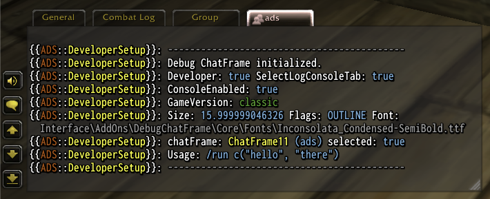

# DebugChatFrame: A Developer's Tool for WoW Addon Development
>A Developer's Library for utilizing a Debug Chat Frame Console for WoW Addon Development

DebugChatFrame is a highly efficient library addon specifically designed to facilitate World of Warcraft addon developers by providing a dedicated and temporary chat frame for debugging. This tool is load-on-demand, ensuring minimal resource usage until it's explicitly needed.

## Features

- **Load on Demand**: Optimizes performance by loading the library only when required.
- **Easy Initialization**: Seamlessly integrate the debug chat frame into your addon environment at your convenience, ensuring it's available exactly when you need it without cluttering your workspace.
- **Temporary Chat Frame**: The debug chat frame does not persist unnecessarily, keeping your development environment clean and your game interface uncluttered.
- **Simple Logging Interface**: Use the straightforward method `chatFrame:log('hello', 'there')` to begin logging messages to the console. This method supports multiple arguments, allowing comprehensive messages to be logged efficiently.

## Available Font Names

Pass one as `opt.font` to `DebugChatFrame:New()`; `opt.fontSize` sets the size. Every font is monospace with an outline.

### Western (`enUS`, `enGB`, `deDE`, `frFR`, `esES`, `esMX`, `itIT`, `ptBR`)

- `DCF_Inconsolata_Regular_Outline`
- `DCF_Inconsolata_SemiBold_Outline`
- `DCF_InconsolataCondensed_SemiBold_Outline`
- `DCF_InconsolataExtraCondensed_SemiBold_Outline`
- `DCF_InconsolataUltraCondensed_SemiBold_Outline`
- `DCF_RobotoMono_Medium_Outline`
- `DCF_NotoSansMono_Regular_Outline`

### Russian (`ruRU`)

- `DCF_RobotoMono_ruRU_Outline`

### Simplified Chinese (`zhCN`)

- `DCF_NotoSansMono_zhCN_Outline`

### Traditional Chinese (`zhTW`)

- `DCF_NotoSansMono_zhTW_Outline`

### Korean (`koKR`)

- `DCF_NotoSansMono_koKR_Outline`

The locale names match `GetLocale()`. Inconsolata has no Cyrillic or CJK glyphs; Roboto Mono has no CJK glyphs.

### Legacy
> **Deprecated:** these names still work, but will be removed in a future release. Migrate to the names above; for example, `DCF_ConsoleMonoCondensedSemiBoldOutline` becomes `DCF_InconsolataCondensed_SemiBold_Outline` (same font file).

Kept for existing integrations: `DCF_ConsoleMonoCondensedSemiBold`, `DCF_ConsoleMonoSemiCondensedBlack`, `DCF_ConsoleMedium`, each with an `Outline` variant (e.g. `DCF_ConsoleMonoCondensedSemiBoldOutline`).

## Usage
To get started, take a look at the [Beginner Guide](doc/Beginners-Guide.md).

The Core _DebugChatFrame-Annotations.lua_ can be found here [DebugChatFrame-Annotations.lua](Libs/Annotations/DebugChatFrame-Annotations.lua).  The Core Interface.lua file contains EmmyLua annotations that will help your IDE provide autocompletion, type checking, and other helpful intellisense features when developing World of Warcraft addons.

## Ideal For

This tool is ideal for addon developers looking for a simple, effective way to manage debug outputs without interfering with the standard gameplay experience. Whether you're developing a new addon or maintaining an existing one, DebugChatFrame provides a crucial service in managing debug information.

### Donations

If DebugChatFrame has made your gameplay or addon development easier, consider supporting its development:

- **[Paypal&trade; Donation](https://www.paypal.com/donate/?hosted_button_id=AX58YP3GSGXVU)**
- **[Bitcoin Donation](https://www.blockchain.com/btc/address/3QQVAwJGkKHMM2oq6CLVWYgfx83TFVwp39)**

## About

- About the Author [(Tony Lagnada)](https://tony.resume.lagnada.com/)
- My AddOn Portfolio Can Be Found Here [Curse Forge/Kapresoft](https://www.curseforge.com/members/kapresoft/projects)